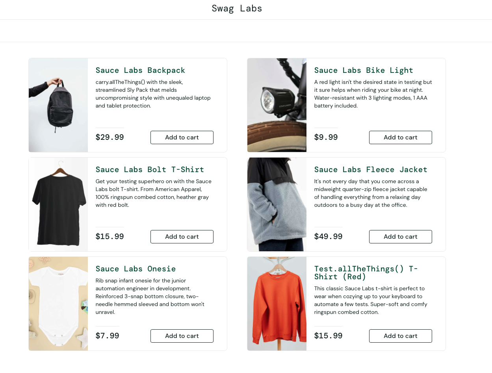
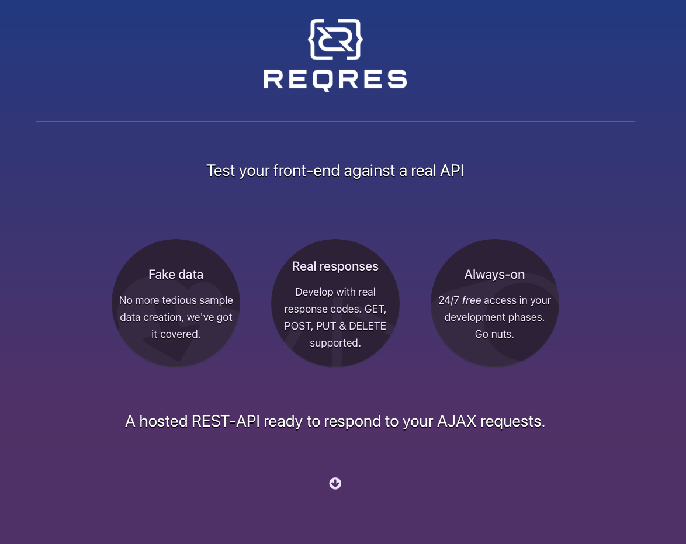
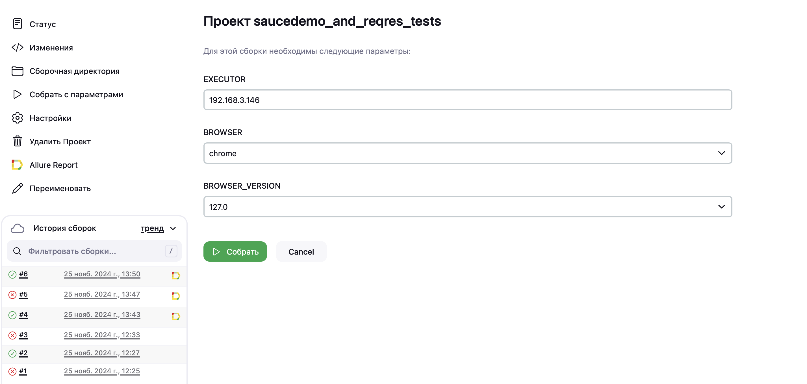
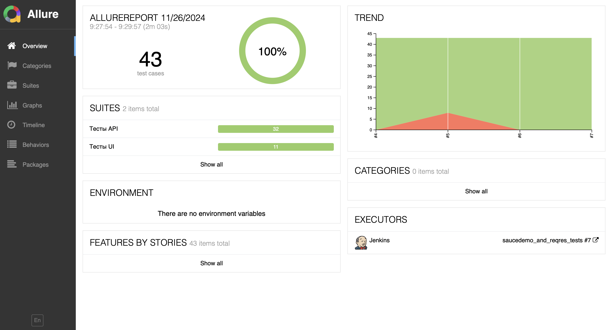

# Демонстрационный проект по автоматизированному тестированию UI сайта <a target="_blank" href="https://www.saucedemo.com">"SAUCEDEMO"</a> и API сайта <a target="_blank" href="https://reqres.in">"REQRES"</a>


###


## Стек технологий:


## Для запуска тестов необходимо:
Клонировать репозиторий и перейти в него:
```
git clone https://github.com/ponomarev-iv1986/saucedemo_and_reqres_in_demo_project.git
cd saucedemo_and_reqres_in_demo_project
```
Создать и активировать виртуальное окружение:
```
python3 -m venv venv
```
- На Linux/macOS:
    ```
    source venv/bin/activate
    ```
- На Windows:
    ```
    venv/Scripts/activate
    ```
Установить зависимости из файла requirements.txt:
```
pip install -r requirements.txt
```
Создать и заполнить .env файл:
```
touch .env
echo SAUCEDEMO_URL="https://www.saucedemo.com" >> .env
echo SAUCEDEMO_LOGIN="any_user_login" >> .env
echo SAUCEDEMO_PASSWORD="ani_user_password" >> .env
echo REQRES_IN_URL="https://reqres.in" >> .env
```
Запустить тесты:
```
pytest
```
### Реализована возможность запуска тестов на <a target="_blank" href="https://aerokube.com/selenoid/latest/">"Selenoid"</a> (Selenoid должен быть развернут).
Для этого выполнить команду:
```
pytest --remote --executor={executor} --browser={browser} --bv={browser_version}
```
Где:
- executor - адрес Selenoid в формате 192.168.1.1
- browser - один из браузеров селеноида
- browser_version - версия браузера селеноида

## Пример удаленного запуска тестов в стеке <a target="_blank" href="https://www.jenkins.io/doc/">Jenkins</a> - <a target="_blank" href="https://aerokube.com/selenoid/latest/">Selenoid</a> - <a target="_blank" href="https://allurereport.org/docs/">Allure</a>.

### Джоба Jenkins для удаленного запуска тестов может выглядеть вот так:



### После прохождения тестов есть возможность зайти в Allure Report и ознакомиться с результатами:

